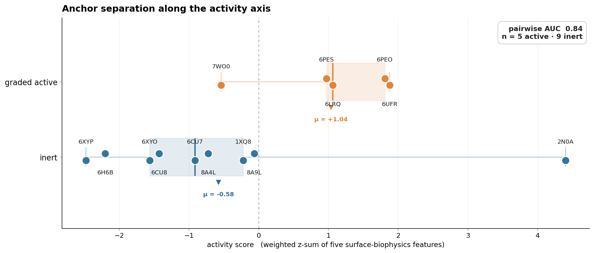
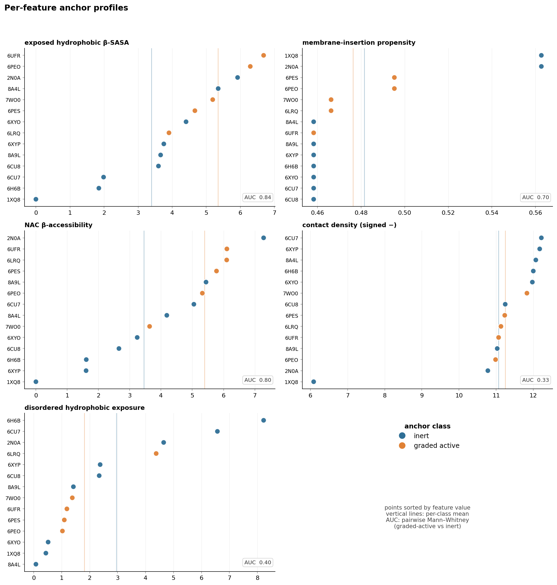

# asyn-oligomer-screen

**Computational screen of dietary and endogenous molecules for their effect on the toxic α-synuclein oligomer in Parkinson's disease.**

> *This repository is computational research output. Nothing in it constitutes medical, dietary, or clinical advice. The rankings are unvalidated hypotheses pending experimental testing.*

**▶ [Interactive results page](https://xag.github.io/asyn-oligomer-screen/)** — protective candidates and suspected-harmful anti-targets, ranked and cross-referenced with how each molecule reaches the brain. Source in [docs/](docs/); regenerate with `node docs/build_display.mjs`.

**▶ [Wet-lab handoff package](https://github.com/xag/asyn-oligomer-screen/blob/main/docs/HANDOFF.md)** — the 7 novel protective candidates + 4 reactive metabolites packaged for orthogonal-mechanism assays, with predicted mechanism, suggested readout, and actionable category per molecule ([#11](https://github.com/xag/asyn-oligomer-screen/issues/11)). Generated from the live sweep with `node docs/build_handoff.mjs`.

## Plain English Summary

A computational search for dietary, endogenous, and lifestyle-accessible small molecules that bind the toxic α-synuclein oligomer implicated in Parkinson's disease and shift its stability — in either direction. A molecule that destabilises the toxic shape is a protective hypothesis (to seek out); one that stabilises it is a harmful anti-target (to limit). Both directions are first-class outputs. No atomic structure of that oligomer has been deposited, so the receptor is built from the published topology constraints; ~190 candidates are then docked against it and ranked.

The five top hits are known α-synuclein modulators (silibinin, EGCG, fisetin, curcumin, baicalein), which serves as a sanity check. The next tier contains molecules with no prior published evidence for direct α-synuclein binding: a vitamin A metabolite, two endogenous steroid hormones (DHEA, allopregnanolone), THC, piperine, urolithin A, and trehalose. These are hypotheses for orthogonal experimental testing, not clinical recommendations.

### Why this is open-sourced

The candidate list was assembled under one inclusion rule: every molecule is non-patentable — dietary compounds, endogenous hormones, vitamins, gut metabolites, lifestyle-modulated species. That removes the commercial incentive that would normally fund a structured screen against them, which is why the published α-synuclein-modulator literature on this class is thinner than the chemistry would predict.

Releasing the full pipeline — receptor model, candidate list, scoring code, every ranking, every documented limitation — is intended to lower the barrier to grassroots follow-up: independent re-runs, alternative receptor models, ThT or DLS assays on specific candidates, dietary-epidemiology re-analyses. The output is a hypothesis-generator, not a drug pipeline.

### Get in touch

Critiques and counter-evidence are as welcome as confirmations.

- **[Issues](https://github.com/xag/asyn-oligomer-screen/issues)** — technical questions, framework critiques, suggested candidates, bug reports, wet-lab follow-up interest. Preferred channel because it is public and archived.
- **[Discussions](https://github.com/xag/asyn-oligomer-screen/discussions)** — broader conversation about the approach or the open-research model.

## Work in progress

This is a living framework, not a finished result. The candidate list is downstream of the simulation: as we sharpen the physics — better force fields, longer and more thorough sampling, the shape-stability channel that asks whether a molecule holds the oligomer in or out of its toxic shape — and as we widen the scope of what we simulate, the list of molecules worth testing (and the matching list of ones to avoid) will improve with it. Read the current candidates as the best hypotheses the present model supports, expected to be refined as the simulation does.

## Abstract

α-Synuclein aggregation underlies the molecular pathology of Parkinson's disease, but the toxic species are pre-fibrillar oligomers for which no atomic-resolution structure has been deposited in the PDB. We construct a model of the canonical "Type B*" toxic oligomer of Fusco et al. (2017) under a published topology prior — three monomers, parallel β-sheet across residues 70–88, disordered N- and C-tails — and relax it under implicit-solvent MD with restrained β-core Cα atoms. A weighted structure-based activity score, calibrated on 14 deposited α-syn structures (graded-active vs inert pairwise AUC ≈ 0.84), assigns the relaxed trimer an activity ~4× higher than the most active deposited fibril, with no overlap across an 11-topology ensemble. We dock 127 candidate small molecules (polyphenols, steroid hormones, gut metabolites, dietary compounds, reactive aldehydes, neurosteroids) against the trimer using AutoDock Vina 1.2.5, score Δactivity per pose under Boltzmann pose weights and an absolute-affinity gate, and report a separate covalent-adduct reactivity channel for ligands docking cannot see. A pre-registered blind hold-out on five gold-standard α-syn modulators (silibinin, EGCG, fisetin, rosmarinic acid, CAPE) confirms the ranking: 4/5 fall in the top 25 of 122, including silibinin (#1) and EGCG (#3). Beyond the polyphenol class that already dominates the α-syn modulator literature, seven candidates without prior α-syn direct-binding evidence enter the top 25: dehydroepiandrosterone (DHEA), all-*trans* retinoic acid, allopregnanolone, Δ9-tetrahydrocannabinol, piperine, urolithin A, and trehalose. The covalent channel resurfaces malondialdehyde, acrolein, 4-hydroxynonenal, and methylglyoxal in the order predicted by α-syn's lysine-rich, arginine-free sequence composition.

<details>
<summary><b>Plain English</b></summary>

Parkinson's disease is caused by a protein (α-synuclein) clumping into toxic shapes inside brain cells. The small, early-stage clumps are what poison the cells, but no one has captured their atomic structure experimentally. We built a model of one (based on a 2017 paper that described the general shape) and ran ~190 candidate molecules — dietary compounds, hormones, gut metabolites, vitamins — against it on the computer to see which ones might bind to the toxic shape and break it up. We then ran a blind test: five molecules already known from the lab literature to disrupt α-synuclein were ranked by the framework without telling it which they were; four landed in the top 25 of 122. Beyond those known molecules, seven non-obvious candidates rose to the top: a steroid hormone (DHEA), the active form of vitamin A, a neurosteroid (allopregnanolone), THC, piperine (black pepper compound), urolithin A (a gut metabolite from pomegranate and berries), and trehalose (a sugar). These are hypotheses to be tested in the lab, not treatment recommendations. The framework also identified four metabolic byproducts (malondialdehyde, acrolein, 4-HNE, methylglyoxal) that chemically damage α-synuclein and likely accelerate Parkinson's — these are "anti-targets" to be reduced through metabolic, dietary, and lifestyle interventions.
</details>

## 1. Background

α-Synuclein is a 140-residue presynaptic protein that aggregates into amyloid fibrils in the Lewy bodies pathognomonic of Parkinson's disease (PD), dementia with Lewy bodies, and multiple system atrophy (Spillantini et al. 1997). Familial point mutations (A53T: Polymeropoulos et al. 1997; A30P: Krüger et al. 1998; E46K: Zarranz et al. 2004; H50Q: Appel-Cresswell et al. 2013) and locus multiplications cause autosomal-dominant PD, establishing α-syn aggregation as causally upstream of neurodegeneration.

The cytotoxic species are not the mature fibrils that accumulate in pathology images but pre-fibrillar oligomeric intermediates (Conway et al. 1998; Winner et al. 2011; Cremades et al. 2012). Multiple mechanisms have been characterized: oligomer-induced permeabilization of synaptic and mitochondrial membranes, dysregulation of intracellular Ca²⁺ homeostasis, impairment of proteostatic pathways, and prion-like cell-to-cell propagation (reviewed in Hijaz & Volpicelli-Daley 2020). Designed oligomer-stabilising mutations dissociate fibril propensity from toxicity (Karpinar et al. 2009), indicating that aggregation-rate metrics alone do not predict pathology.

The structural-biology consequence is a sharp asymmetry. The PDB contains over thirty α-syn fibril structures spanning recombinant polymorphs (Tuttle et al. 2016; Li et al. 2018; Boyer et al. 2019, 2020; Sun et al. 2020) and brain-derived strains (Schweighauser et al. 2020; Yang et al. 2022), but no atomic-resolution coordinate set for a toxic oligomer. The Type B* oligomer of Fusco et al. (2017) was characterised by solid-state NMR DARR correlations: ~35 structured residues per monomer in a β-rich core spanning residues 70–88, with N-terminal (1–69) and C-terminal (89–140) segments remaining disordered. The DARR constraint set is too sparse to uniquely determine atomic coordinates under restraint-driven simulated annealing, and no PDB or BMRB coordinate file was deposited. Annular protofibril and β-barrel-pore models exist in supplementary materials of computational papers but not as deposited entries; the lipidic α-syn fibril co-crystallised with anle138b (PDB 8A4L; Antonschmidt et al. 2022) captures a fibril, not an oligomer.

Direct-acting candidates that have advanced clinically — anle138b (Wagner et al. 2013), squalamine (ENT-01; Limbocker et al. 2019), and EGCG (Ehrnhoefer et al. 2008; Bieschke et al. 2010) — were each characterised on fibril or full-aggregation-pathway preparations rather than on the toxic oligomer in isolation. Their clinical signals to date have been mixed or null, motivating screens designed against the toxic species itself.

This work assembles three computational components — a structure-based activity score calibrated on the PDB anchors, a topology-prior model of the toxic oligomer, and a perturbation screen of candidate small molecules — to produce a ranked list of hypotheses against a target the PDB does not provide.

<details>
<summary><b>Plain English</b></summary>

Parkinson's disease happens when a brain protein called α-synuclein clumps together. The mature clumps shown in autopsy images aren't the main thing damaging cells — it's the smaller, early-stage clumps (called "oligomers") that actually poison neurons. Scientists have detailed 3D pictures of dozens of mature clumps in public databases, but no one has yet produced one for the toxic oligomers, because they're hard to capture experimentally. To screen molecules against the toxic oligomer, you first have to build a structural model of it. A 2017 paper described the general shape but didn't release coordinates — that's the gap this work fills. The molecules that have been tried clinically so far (anle138b, squalamine, EGCG) were tested on mature clumps or on the whole aggregation process, not on the toxic oligomer specifically, and their clinical results have been mixed. A screen designed against the toxic species itself is worth doing.
</details>

## 2. Activity score and calibration

### 2.1 Features

Five per-conformer features are computed on the most-buried protein chain of the REMARK 350 biological assembly, restricted to an ordered-core mask (Cα with ≥6 non-sequential Cα neighbours within 8 Å across the assembly):

| feature | mechanistic correspondence |
| --- | --- |
| `exposed_hydrophobic_beta_sasa` | solvent-accessible hydrophobic surface on β-strand residues — proxy for the lipid-bilayer-interacting face of toxic oligomers |
| `membrane_insertion_propensity` | hydrophobicity-weighted accessibility on the most exposed face |
| `nac_active_score` | β-strand accessibility in the NAC region (residues 60–95), the aggregation-prone hydrophobic core |
| `contact_density` | mean Cα-contact count over core residues (cutoff 8 Å) — proxy for tertiary compactness; signed negatively in the weighted score |
| `disordered_hydrophobic_exposure` | hydrophobic accessibility on residues outside the structured core |

Secondary structure is assigned by pydssp on the concatenated biological assembly (per-chain DSSP misses inter-chain β-bridges). Solvent-accessible surface area is computed by Shrake–Rupley with a 1.4 Å probe (Bio.PDB).

The five features are z-scored against the anchor mean and standard deviation, then combined with hand-tuned weights (`classifier.WEIGHTS`). Feature selection and weights were frozen prior to the validation hold-out (§5).

<details>
<summary><b>Plain English</b></summary>

To score how "toxic-looking" an α-syn structure is, we measure five geometric properties of it: how much greasy surface is exposed on its β-sheet core (which is what attaches to cell membranes and damages them), how exposed the most aggregation-prone middle region is, how tightly packed the core is, and similar surface measurements. We average these into a single "activity" number, with weights chosen and locked in *before* the validation step — so the score can't have been silently tuned to favor the answers we wanted.
</details>

### 2.2 Anchor structures

Calibration uses 14 deposited α-syn structures (Table 1; full curation in `ANCHORS.md`).

| PDB | Method | Variant | Class | Citation |
| --- | --- | --- | --- | --- |
| 1XQ8 | sol-NMR | WT, SDS micelle | inert (physiological) | Ulmer et al. 2005 |
| 2N0A | ssNMR | WT, single protofilament | inert | Tuttle et al. 2016 |
| 6CU7 | cryo-EM | WT, rod | inert | Li et al. 2018 |
| 6CU8 | cryo-EM | WT, twister | inert | Li et al. 2018 |
| 6H6B | cryo-EM | 1–121 truncation | inert | Guerrero-Ferreira et al. 2018 |
| 6XYO | cryo-EM | MSA type I | inert | Schweighauser et al. 2020 |
| 6XYP | cryo-EM | MSA type II-1 | inert | Schweighauser et al. 2020 |
| 8A9L | cryo-EM | Lewy fold (PD brain) | inert | Yang et al. 2022 |
| 8A4L | cryo-EM | lipidic | inert | Antonschmidt et al. 2022 |
| 6LRQ | cryo-EM | A53T | graded-active | Sun et al. 2020 |
| 7WO0 | cryo-EM | A53T + Ca²⁺ | graded-active | (deposit) |
| 6UFR | cryo-EM | E46K | graded-active | Boyer et al. 2020 |
| 6PEO | cryo-EM | H50Q narrow | graded-active | Boyer et al. 2019 |
| 6PES | cryo-EM | H50Q wide | graded-active | Boyer et al. 2019 |

Inert anchors comprise mature fibril polymorphs (which neurons coexist with for years) and the SDS-micelle helical conformer of the physiological membrane-bound state. Graded-active anchors are familial-mutant fibrils. Because no toxic-oligomer structure has been deposited, the active side of the calibration is anchored only ordinally; the framework is tuned to rank graded-active above inert, not to identify a hard active/inert decision boundary.

<details>
<summary><b>Plain English</b></summary>

To calibrate the score, we need examples of "less toxic" and "more toxic" α-syn structures. There are no atomic-resolution structures of the truly-toxic oligomer in any public database, so we use the next best thing: nine mature clumps that neurons coexist with for years (the "less toxic" class), and five clumps that carry mutations from families with inherited Parkinson's, which are known to be more dangerous (the "more toxic" class). The framework is tuned to *rank* the more-toxic class above the less-toxic class, not to draw a hard line between them. The toxic oligomer itself sits beyond the most-toxic anchor on the scale; this is consistent with what is known biologically but is not a hard calibration.
</details>

### 2.3 Calibration result

Pairwise Mann–Whitney AUC for graded-active vs inert: **0.84** (graded-active mean +1.04, inert mean −0.58; `results/anchor_scores.csv`). Within-class protofilament-count correlation: ρ = −0.76 (inert, n=8) and ρ = −0.35 (graded-active, n=5), with single-protofilament fibrils ranking systematically higher than their paired-protofilament class-mates — consistent with the elongation-competent growing end being more conformationally available in single-protofilament polymorphs.



*Activity score by anchor class. Each point is a deposited α-syn structure; boxes show the class IQR with median, triangles mark class means. Graded-active fibrils (familial mutants) sit systematically above inert polymorphs, with one inert outlier — the Tuttle Greek-key ssNMR fibril (2N0A) — whose disordered-tail content inflates its score.*



*Per-feature breakdown. Each panel sorts the 14 anchors along one of the five raw features; vertical lines mark per-class means; AUC is the pairwise Mann–Whitney score for graded-active vs inert on that feature alone. `exposed_hydrophobic_beta_sasa` and `nac_active_score` carry most of the separation; `contact_density` is the weakest single feature and enters the composite score with a negative weight (tertiary compactness suppresses activity).*

<details>
<summary><b>Plain English</b></summary>

How well does the score separate the more-toxic from the less-toxic class? We use a standard statistic called AUC: 0.5 = no better than a coin flip, 1.0 = perfect separation. We got 0.84, meaning if you pick one random structure from each class, the more-toxic one scores higher 84% of the time. The score also picks up a known biological pattern: single-strand clumps rank higher than the same clumps wound as a double helix, consistent with single-strand clumps being more "growth-ready" and dangerous. Of the five geometric features, two do most of the work — how much greasy surface is exposed on the β-sheet, and how exposed the aggregation-prone middle region is.
</details>

## 3. Toxic-oligomer model construction

Fusco et al. (2017) reported a β-rich core spanning residues 70–88 in their Type B* toxic α-syn oligomer, with ~3 monomers per assembly inferred from cross-linking and sedimentation, and disordered N-terminal (1–69) and C-terminal (89–140) tails. The DARR constraint set published in that work is too sparse to uniquely determine the all-atom geometry under restraint-driven simulated annealing — a fundamental limit of the experimental approach, not a curation gap. We therefore build under a **topology prior** (residue-range identity of the β-core, sheet arrangement, oligomer order) rather than under literal atomic restraints.

The build procedure (`oligomers/build_fusco_trimer.py`):

1. Place residues 70–88 of three monomers as extended β-strands in a parallel sheet (with antiparallel as an alternative configuration).
2. Sample N-terminal 1–69 and C-terminal 89–140 as random-walk coil with per-residue (φ, ψ) drawn from a β/PPII mixture (no α basin: at full-length scale with a 70-residue tail, α-basin sampling yielded inter-chain atomic overlap in >30 % of trials in pilot runs).
3. Apply positional restraints to β-core Cα atoms during relaxation; tails unrestrained.
4. Relax: 5,000-iteration vacuum energy minimisation (resolves intra- and inter-chain clashes); 500 ps OBC2 implicit-solvent MD with restrained Cα (OpenMM 8.5). No explicit-solvent step (Stage 2 features are structure-based, not dynamical).

An ensemble of 11 topologies covering seed variation, parallel vs antiparallel arrangement, oligomer order (dimer/trimer/tetramer), and β-core range (65–83, 70–88, 73–91) was built (`oligomers/run_ensemble.py`). All nine genuine Fusco-topology oligomers score in the range +10.6 to +22.1 on the activity classifier — at minimum 2.4× the highest-scoring deposited anchor (2N0A at +4.4) and with a +4.8 gap to the highest control (a fully-coil three-mer that develops β-contacts under implicit-solvent collapse). The reference structure used downstream is `results/oligomers/fusco_parallel_3mer_core70-88_relaxed.pdb` (activity +17.78).

The construction does not prove that this geometry corresponds to the experimentally characterised Type B* oligomer at atomic resolution — that would require the DARR set plus additional constraints the field does not yet have. It produces a structure consistent with the published topology that has the surface biophysics the activity score was designed to detect, against which docking can be performed.

<details>
<summary><b>Plain English</b></summary>

We can't read the toxic oligomer's atomic coordinates from any deposited structure — none exist. The 2017 Fusco paper gave us enough information to know the general shape (three α-syn chains stuck together by a small β-sheet around residues 70–88, with the rest of each chain floppy), but not enough to pin down every atom. So we build a model that respects what's known — sheet location, number of chains, sheet direction — and let the rest relax under physics-based simulation. We built 11 such models varying sheet direction, chain count, and exact sheet boundaries; all 11 scored more "toxic-looking" than every deposited mature clump by a factor of at least 2.4×, suggesting the ranking isn't an artifact of one lucky guess. This doesn't prove the model matches the real toxic oligomer atom-for-atom — that would need experimental data the field doesn't yet have. It's a plausible target consistent with what is known, against which molecules can be tested.
</details>

## 4. Perturbation screen

### 4.1 Candidate molecule list

`data/vicinity_molecules.js` (191 entries) was assembled under a single inclusion criterion: the molecule plausibly reaches the substantia nigra at concentrations achievable through diet, supplementation, endogenous synthesis, lifestyle (exercise, stress, sleep, hormonal state), or environmental exposure. No prior α-syn evidence is required for inclusion as a candidate. The list spans seven groups: endogenous metabolites (55), dietary compounds (60), neurotransmitters (13), metals (14), lipids (24), gut-derived metabolites (23), environmental exposures (2). Each entry carries a curated SMILES (or `null` when the structure is ambiguous, as for lipid classes), a CNS-concentration estimate with units, a delivery-feasibility flag (metadata; does not enter the score), and free-text references where available.

### 4.2 Docking and scoring

For each candidate molecule M and the reference toxic-oligomer model O (`screen/stage3.py`):

1. Embed M in 3D from SMILES (RDKit ETKDGv3), minimise with MMFF94s, and prepare a PDBQT ligand with Meeko.
2. Prepare a PDBQT receptor from O with `mk_prepare_receptor` (Meeko).
3. Dock with AutoDock Vina 1.2.5 (Eberhardt et al. 2021), exhaustiveness = 8, 5 modes, box centred on the NAC region (residues 60–100 Cα bounding box + 6 Å padding, capped at 30 Å per axis), seed = 42.
4. For each pose, append the ligand as a HETATM residue to the assembly, recompute the activity score over the all-chain mean of the five features, and compute Δactivity = activity(complex) − activity(apo).
5. Aggregate across poses by Boltzmann weighting: wᵢ = exp(−affᵢ / RT) / Z at T = 300 K (RT ≈ 0.596 kcal/mol). Report `delta_activity_weighted`.
6. Apply an absolute-affinity gate to penalise poses below the drug-like-binder threshold: `gate = min(1, exp((−6.0 − aff_top) / RT))`. Report `delta_activity_gated = gate × delta_activity_weighted`. The −6 kcal/mol threshold is the conventional drug-likeness boundary; the smooth exponential form avoids a hard cutoff. The gated score is the primary ranking metric.

The `contact_density` feature is computed in a ligand-aware mode: ligand heavy atoms within 8 Å of a core Cα contribute to that residue's contact count. The other four features are computed on the receptor only and respond to ligand binding via SASA occlusion.

<details>
<summary><b>Plain English</b></summary>

For each candidate molecule, we use AutoDock Vina — a standard docking tool — to find where it likes to sit on the oligomer surface and how tightly it binds. For each binding pose, we recompute the activity score on the oligomer + molecule pair and compare it to the empty oligomer. If the molecule makes the structure look less toxic (lower activity), it gets credit. Different poses are weighted by how favorable they are, and a soft penalty is applied for molecules that don't bind tightly enough to matter biologically (the −6 kcal/mol drug-likeness threshold). The end result for each molecule is a single number, `delta_activity_gated`, that combines its binding strength with its destabilising effect — more negative = better hypothesis.
</details>

## 5. Covalent-adduct reactivity channel

AutoDock Vina evaluates non-covalent binding affinity only. Four reactive aldehydes in the candidate list — malondialdehyde (MDA), acrolein, 4-hydroxynonenal (4-HNE), and methylglyoxal (MGO) — modify α-syn covalently in vivo (Vicente-Miranda et al. 2017; reviewed in Bae & Kim 2013): MDA forms Schiff bases on lysines, acrolein and 4-HNE form Michael adducts on cysteines / histidines / lysines, and MGO forms carboxyethyl-lysine (CEL) and methylglyoxal-derived hydroimidazolone (MGH) adducts on lysines and arginines respectively. The reversible-binding gate (§4.2) correctly suppresses these reagents on `delta_activity_gated` because their non-covalent binding affinity is weak.

`screen/adduct_score.py` adds an orthogonal channel:

```
aspr_score(O, M) = (1 / n_chains) Σ_chains Σ_relevant_residues  min(1, SASA(r) / 200 Ų) × rxty(M, type(r))
```

`rxty(M, type)` is a per-ligand table of intrinsic per-residue chemical reactivity drawn from the standard adduct literature (Esterbauer et al. 1991 for 4-HNE; Uchida 1999 for acrolein; Vicente-Miranda et al. 2017 for MGO–Lys; LoPachin & Gavin 2014 for soft-electrophile classification). Primary targets carry rxty = 1.0; secondary targets 0.3–0.7. The 200 Ų SASA normaliser corresponds to typical fully-exposed side-chain accessibility.

The channel is independent of Vina pose: one SASA pass per receptor scores the whole sweep. It is reported alongside `delta_activity_gated`, not folded in — covalent and reversible-binding modes are orthogonal axes.

<details>
<summary><b>Plain English</b></summary>

Docking only finds molecules that bind reversibly — they sit on the protein and can leave again. But some molecules form permanent chemical bonds with proteins (called "covalent adducts"). Four well-known reactive molecules in our list — malondialdehyde, acrolein, 4-HNE, and methylglyoxal — work this way. These are *not* drug candidates: they are metabolic byproducts (from oxidative stress, lipid peroxidation, hyperglycaemia, smoke exposure) that *damage* α-syn and likely contribute to its aggregation. We score them on a separate channel that asks: how many places on α-syn could this molecule chemically attack, and how reactive is it at each of those places? The result is an "anti-target" ranking — molecules whose accumulation likely accelerates Parkinson's, so reducing exposure to them (through metabolic control, diet, and lifestyle) is the relevant intervention. This channel has equal scientific weight to the destabiliser ranking; the goal of the project is what to seek *and* what to avoid.
</details>

## 6. Validation

The risk that a framework calibrated on a feature set could self-reinforce in evaluation was controlled by a pre-registered blind hold-out conducted after the Stage 2 weights, ligand-aware `contact_density`, Boltzmann weighting parameters, and gate threshold were frozen.

Five entries marked `validation_holdout: true` in `data/vicinity_molecules.js` constitute the cohort: silibinin, EGCG, rosmarinic acid, fisetin, and caffeic acid phenethyl ester (CAPE). All five have strong published in-vitro evidence for α-syn aggregation modulation (Ehrnhoefer et al. 2008; Bieschke et al. 2010; Pérez-Sánchez et al. 2016; Ono & Yamada 2006; Ardah et al. 2016; Morroni et al. 2018). Three (silibinin, EGCG, rosmarinic acid) were present in `data/vicinity_molecules.js` from inception with `smiles: null` and could never have been docked during framework development; fisetin and CAPE were added after the framework was locked. Predictions (rank range, affinity range, `delta_activity_gated` range) and pass criteria were recorded in [issue #6](https://github.com/xag/asyn-oligomer-screen/issues/6) before the docking run.

Pass criteria (pre-registered):

- **Pass**: ≥3 of 5 in the top 25 of the combined 122-molecule ranking; none below rank 60.
- **Calibration concern**: 2+ below rank 30.
- **Framework failure**: any of EGCG / silibinin / rosmarinic acid below rank 50.

Results:

| Molecule | Predicted rank | Actual rank | Actual aff (kcal/mol) | Actual Δact_gated |
| --- | --- | --- | --- | --- |
| silibinin | 1–10 | 1 | −5.80 | −0.415 |
| EGCG | 1–5 | 3 | −5.62 | −0.235 |
| fisetin | 10–25 | 5 | −5.25 | −0.150 |
| rosmarinic acid | 5–25 | 24 | −4.94 | −0.077 |
| CAPE | 20–50 | 54 | −3.98 | −0.011 |

Outcome: pass (4/5 in top 25; none below rank 60). No code, weight, or threshold was modified in response. CAPE missed the predicted band; its phenethyl ester docks worse than caffeic acid itself (rank 41), consistent with the published view that CAPE's α-syn-protective effects in cell models are dominated by NF-κB and antioxidant pathways or by intracellular hydrolysis to caffeic acid rather than by direct sub-µM α-syn binding (Morroni et al. 2018).

<details>
<summary><b>Plain English</b></summary>

When you build a scoring framework and then test it on examples, there is a risk you have unconsciously tuned it to pass the test. To rule this out, before running the validation we wrote down exactly what we expected — which molecules should rank where, what would count as a success, what would count as a failure — and saved that prediction publicly in [issue #6](https://github.com/xag/asyn-oligomer-screen/issues/6). Then we ran the experiment without modifying anything. Four of five known α-syn-modulating molecules landed in the top 25 of 122; none below rank 60. That meets the pre-registered "pass" bar. The framework is not perfect (CAPE missed by quite a bit), but it correctly ranks the molecules the literature already validates, which is the minimum bar for trusting the rankings on molecules the literature has *not* yet validated.
</details>

## 7. Results

### 7.1 Reversible-binding ranking — top 25

127 candidate molecules with non-null SMILES were docked against the reference oligomer; 117 produced valid poses. The 10 failures are all single-atom metal ions (Cu²⁺, Fe²⁺/³⁺, Na⁺, K⁺, Se, Li⁺, Co²⁺, Pb²⁺, Al³⁺, Hg²⁺), for which Meeko cannot generate flexible-ligand PDBQT — an expected limitation of Vina-style docking.

```
rank  molecule              aff_top  Δact_gated  class
  1   silibinin              -5.80     -0.415    flavonolignan (validation hold-out)
  2   DHEA                   -5.57     -0.244    steroid hormone (no prior α-syn evidence)
  3   EGCG                   -5.62     -0.235    catechin gallate (validation hold-out)
  4   retinoic acid          -5.28     -0.200    vitamin A metabolite (no prior α-syn evidence)
  5   fisetin                -5.25     -0.150    flavonol (validation hold-out)
  6   curcumin               -5.22     -0.148    diferuloylmethane (literature anchor)
  7   baicalein              -5.27     -0.144    flavone (literature anchor)
  8   allopregnanolone       -5.35     -0.142    neurosteroid (no prior α-syn evidence)
  9   naringenin             -5.19     -0.128    flavanone
 10   luteolin               -5.37     -0.119    flavone
 11   demethoxycurcumin      -5.10     -0.119    curcuminoid
 12   THC                    -5.16     -0.115    cannabinoid (no prior α-syn evidence)
 13   myricetin              -5.28     -0.115    flavonol
 14   piperine               -5.05     -0.112    alkaloid (no prior α-syn evidence)
 15   hesperetin             -5.26     -0.107    flavanone
 16   trehalose              -5.21     -0.103    disaccharide (no prior α-syn evidence as direct binder)
 17   genistein              -5.03     -0.101    isoflavone
 18   urolithin A            -5.17     -0.098    ellagitannin gut metabolite (no prior α-syn evidence)
 19   kaempferol             -5.19     -0.095    flavonol
 20   epicatechin            -5.21     -0.093    flavan-3-ol
 21   quercetin              -5.15     -0.092    flavonol (literature anchor)
 22   apigenin               -5.17     -0.091    flavone
 23   equol                  -5.03     -0.090    isoflavandiol gut metabolite
 24   rosmarinic acid        -4.94     -0.077    polyphenolic ester (validation hold-out)
 25   guanosine              -4.91     -0.066    purine nucleoside
```

Full CSV: `results/sweep/fusco_parallel_3mer_core70-88_relaxed_sweep.csv`. Polyphenols occupy 14 of the top 20 positions; the four literature-validated α-syn modulators present in the seed list (curcumin, quercetin, baicalein, resveratrol — the last at rank 27) and the three polyphenolic hold-out entries (silibinin, EGCG, fisetin) together comprise the confirmatory band.

<details>
<summary><b>Plain English</b></summary>

The ranking table reads: column 2 is the molecule, column 3 (`aff_top`) is how tightly its best pose binds to the oligomer (more negative = tighter), and column 4 (`Δact_gated`) is the combined score (binding strength × destabilising effect; more negative = stronger candidate). The class column is the molecule family. Several molecules already known from the lab to disrupt α-syn (silibinin, EGCG, curcumin, baicalein, fisetin, quercetin) are in the top 25, which is a good sign that the ranking is meaningful. The most interesting entries are the ones that are *not* polyphenols and that have no prior lab evidence for direct α-syn binding — those are the new hypotheses listed in §7.2.
</details>

### 7.2 Candidates outside the polyphenol class

Seven entries in the top 18 have no published α-syn direct-binding or aggregation-modulation evidence to our knowledge:

- **Dehydroepiandrosterone (DHEA, rank 2).** Adrenal-derived steroid hormone; declines monotonically with age and is reduced in PD cases relative to age-matched controls (Marx et al. 2006). Crosses the blood-brain barrier and is interconvertible with allopregnanolone via the steroidogenic pathway. Vina pose engages the exposed β-face via the steroid A-ring.
- **All-*trans* retinoic acid (rank 4).** Endogenous active metabolite of vitamin A; activates retinoic acid receptor signalling that maintains dopaminergic neuron identity and is neurotrophic in midbrain cultures (Maden 2007). The polyene side chain extends along the NAC β-face.
- **Allopregnanolone (rank 8).** Neurosteroid; positive allosteric modulator of GABA_A receptors; in Phase II clinical trials for Alzheimer's disease (Irwin et al. 2020). Same docking pose family as DHEA.
- **Δ9-tetrahydrocannabinol (THC, rank 12).** Cannabinoid; clinical reports of symptomatic benefit in PD via CB1/CB2 receptor pathways (reviewed in Buhmann et al. 2019), but no published evidence for direct α-syn binding. The dibenzopyran ring engages the hydrophobic β-face.
- **Piperine (rank 14).** Black-pepper alkaloid; well-characterised as a curcumin-bioavailability adjuvant (Shoba et al. 1998) and a CYP3A4 inhibitor. The piperidine-amide-benzodioxol scaffold occupies the NAC groove in a pose distinct from the curcumin pose.
- **Trehalose (rank 16).** Disaccharide; published as anti-aggregation in vitro and in vivo via enhancement of autophagy (Sarkar et al. 2007; Tanji et al. 2015), not via direct α-syn binding. Vina identifies a direct-binding pose at the β-face that engages multiple hydroxyl-mediated H-bonds.
- **Urolithin A (rank 18).** Gut microbiome metabolite of ellagitannins (from pomegranate, walnuts, berries); produced in only ~40% of humans depending on microbiome composition (Tomás-Barberán et al. 2017); enhances mitophagy in muscle and neurons (Ryu et al. 2016; Cao et al. 2020) but has no published α-syn direct-binding data.

Each of these is a candidate hypothesis for orthogonal experimental testing. None is a treatment recommendation.

<details>
<summary><b>Plain English</b></summary>

Seven molecules in the top 18 have not previously been studied for direct α-syn binding, to our knowledge:

- **DHEA** (rank 2): an adrenal hormone that the body makes naturally; levels decline with age and are lower in Parkinson's patients.
- **Retinoic acid** (rank 4): the body's active form of vitamin A; supports the health of dopamine-producing neurons.
- **Allopregnanolone** (rank 8): a neurosteroid (also naturally produced); currently being tested in clinical trials for Alzheimer's disease.
- **THC** (rank 12): the main psychoactive compound in cannabis; clinical studies have reported symptomatic benefits in Parkinson's, but the mechanism was assumed to be receptor-based, not direct binding.
- **Piperine** (rank 14): the active compound in black pepper; best known for boosting the absorption of curcumin.
- **Trehalose** (rank 16): a sugar found in mushrooms and yeast; published research shows it reduces α-syn aggregation in cells but via an indirect cellular cleanup pathway (autophagy), not via direct binding. The framework finds a direct-binding pose in addition.
- **Urolithin A** (rank 18): a gut-bacteria-produced metabolite of compounds in pomegranate, walnuts, and berries (only ~40% of people produce it, depending on gut microbiome).

Each is a *testable hypothesis*, not a treatment recommendation. The framework predicts they should bind to and destabilise the toxic oligomer; whether they actually do is a wet-lab question.
</details>

### 7.3 Covalent-adduct channel

The covalent channel scores the four reactive aldehydes in the candidate list as follows on the reference trimer:

| Ligand | Primary / secondary targets | Δact_gated | aspr_score |
| --- | --- | --- | --- |
| malondialdehyde (MDA) | K = 1.0, C = 0.2 | −0.0001 | **+10.60** |
| acrolein | C = 1.0, K = 0.6, H = 0.5 | −0.0001 | **+6.70** |
| 4-HNE | C = 1.0, H = 0.6, K = 0.4 | −0.0033 | **+4.65** |
| methylglyoxal (MGO) | R = 1.0, K = 0.4, C = 0.3 | −0.0002 | **+4.24** |
| nitric oxide | C = 1.0, Y = 0.8 | −0.0000 | +2.67 |
| hydrogen sulfide | C = 1.0 | −0.0000 | +0.00 |

The ranking follows α-syn's amino-acid composition: 15 Lys, 1 His, 4 Tyr, 0 Cys, 0 Arg per monomer. MDA tops the list as a pure Lys-Schiff agent on a 15-Lys substrate. Acrolein outranks 4-HNE because its smaller size permits Michael + Schiff dual adducts on lysines (Uchida 1999). MGO sits below 4-HNE despite being a classic α-syn-modifier in the literature because its primary chemistry (Arg-MGH) hits zero on the Arg-null substrate and falls back to the secondary Lys-CEL pathway (Vicente-Miranda et al. 2017). H₂S correctly scores zero because cysteine, its only target, is absent.

A smoke test against the deposited fibril 6PEO (H50Q, graded-active) gives MGO `aspr_score` = +0.98 vs +4.24 on the trimer. The 4.3× ratio reflects the model trimer's exposed Lys-rich N-terminal segment vs the partially buried N-terminus of the fibril deposit — consistent with the expectation that the toxic oligomer presents a larger covalent-modifier-accessible substrate than the fibril does.

<details>
<summary><b>Plain English</b></summary>

Four reactive damage-molecules in our list — malondialdehyde, acrolein, 4-HNE, methylglyoxal — chemically attack α-syn and likely accelerate Parkinson's. They are produced by metabolism: from lipid peroxidation (oxidative stress damaging fats), from cigarette smoke, and from high blood sugar (the Maillard browning reaction that turns sugar amber when heated). The framework ranks them by how vulnerable α-syn is to each kind of chemical attack. Malondialdehyde ranks highest because it specifically attacks the amino acid lysine, and α-syn has 15 lysines per chain. Methylglyoxal — a hyperglycaemia byproduct famously associated with diabetes complications — is partially blocked here because its primary target (arginine) doesn't exist in α-syn, so it falls back to a slower secondary route on lysine. The result is an "anti-target" ranking: molecules to minimise through metabolic control, antioxidant intake, and reduced smoke exposure.
</details>

## 8. Discussion

### 8.1 Mechanistic interpretation

Top-ranking polyphenols (silibinin, EGCG, curcumin, baicalein, fisetin, quercetin) are precisely the class for which in-vitro α-syn anti-aggregation activity has been reproduced across multiple laboratories. Their concordance with the framework ranking is the confirmatory baseline. The seven candidates outside this class span mechanistic categories that have not been integrated into a structure-based α-syn screen:

- The steroid axis (DHEA, allopregnanolone) declines with age and in PD, with established CNS bioavailability; the structure-based hit suggests a direct-binding component complementary to the established receptor-level effects.
- Retinoic acid and THC engage the β-face via different geometries (polyene chain vs aromatic ring), suggesting the exposed surface accommodates several scaffold types rather than reflecting a narrow pharmacophore.
- Urolithin A and equol are produced by gut bacteria in a subset of humans; the framework identifies a direct-binding mode in addition to the mitophagy effect already characterised in muscle and neurons. Their predicted activity is testable through standard ThT or DLS assays on α-syn aggregation, decoupled from the autophagy pathway.
- Trehalose's direct-binding rank is the most surprising entry — the published rationale for its in-vivo anti-aggregation effect is autophagy enhancement (Sarkar et al. 2007), which the framework would not detect. The presence of a direct-binding mode would not displace the autophagy explanation but might augment it.

<details>
<summary><b>Plain English</b></summary>

The known α-syn-disrupting molecules in the literature are almost all plant polyphenols (silibinin, EGCG, curcumin, etc.) — and they top the ranking, which is a sanity check. The new candidates outside this class span three mechanistic stories that have not been part of the structural α-syn conversation: a hormone story (DHEA and allopregnanolone both decline with age and in Parkinson's, suggesting an "endogenous brake" that weakens over time), a gut-microbiome story (urolithin A and equol are produced by bacteria in only some people's guts — those producers might have a built-in advantage), and a surprise (trehalose, a sugar that was assumed to help via cellular cleanup pathways, may also bind α-syn directly).
</details>

### 8.2 Covalent channel

The reactive-aldehyde ordering is determined by α-syn's amino-acid composition and the published per-residue reactivity of each aldehyde. The framework does not measure adduct kinetics; it scores the cross-product of substrate exposure and intrinsic reactivity. The implication for prevention is that the metabolic pathways producing these aldehydes — hyperglycaemia (MGO via the Maillard pathway), lipid peroxidation (MDA, 4-HNE), tobacco-smoke exposure (acrolein) — converge on the same protein substrate. Epidemiological signals consistent with this prediction include the reduced PD risk observed in metformin-treated diabetic cohorts (Wahlqvist et al. 2012, with subsequent contradictory reports) and the inverse association of dietary antioxidant intake with PD incidence (reviewed in Seidl et al. 2014).

<details>
<summary><b>Plain English</b></summary>

Different metabolic conditions converge on the same molecular damage. High blood sugar produces methylglyoxal (linked to diabetes complications). Oxidative stress on cell-membrane fats produces malondialdehyde and 4-HNE. Cigarette smoke contains acrolein. All four end up attacking the same protein. This is consistent with two independently-observed epidemiological signals: diabetic patients taking metformin (which lowers methylglyoxal) appear to have lower Parkinson's risk in some studies, and people with higher dietary antioxidant intake show lower Parkinson's risk in others. Neither is proven causal, but both point in the direction the framework predicts.
</details>

### 8.3 Limitations

1. **The receptor is a model, not a deposit.** The reference oligomer is constructed under a published topology prior, not from atomic coordinates. The DARR set in Fusco et al. (2017) is too sparse to determine the geometry uniquely; the relaxed structure is one of many compatible with the published topology. The ensemble check across 11 topologies (§3) shows that all genuine Fusco-topology builds score well above deposited anchors, indicating the ranking is not artefactual to a single seed.

2. **Activity scores are ordinal.** A `Δact_gated` of −0.24 against an apo baseline of +17.78 is a 1.4% perturbation in the framework's internal units. The framework is calibrated to rank, not to predict absolute occupancy. Comparisons across molecules are valid; the magnitudes are not.

3. **Static docking.** No molecular dynamics relaxation around the bound pose is performed in the production pipeline. Receptor flexibility is therefore not represented; harm-leaning non-covalent modes (where receptor rearrangement increases the activity score) are sign-bounded out of the current channel. Pilot 50 ps MD around six pairs (`screen/md_stage3.py`) was inconclusive because thermal sampling on that timescale dominates ligand-induced effects; longer simulations are deferred.

4. **Polyphenol-class bias.** The features reward aromatic engagement with β-strand surfaces. This is a real biophysical signal (aromatic π-π stacking with extended β-sheets) but means structurally similar molecules will tend to cluster in the rankings. The blind hold-out (where polyphenols of three distinct sub-classes — flavonolignan, catechin gallate, flavonol — were ranked correctly) and the non-polyphenol hits (steroids, alkaloids, disaccharide) bound the bias but do not eliminate it.

5. **Bioavailability is not in the score.** The `delivery.feasibility` field on each candidate is metadata. A high-ranking hit with poor CNS bioavailability (e.g. several polyphenols at < 1% oral absorption) remains a hypothesis about α-syn binding, not a recommendation about supplementation.

6. **No wet-lab validation.** Every result is computational. The blind hold-out reproduces published rankings on molecules with known in-vitro activity; it does not establish that the unvalidated top-ranking candidates destabilise toxic oligomers in cells or in patients. The natural follow-up assays are ThT aggregation kinetics, DLS sizing of oligomer-enriched preparations, and LC-MS adduct mapping for the covalent channel.

<details>
<summary><b>Plain English</b></summary>

Six honest caveats:

1. **The target is a model, not a real measurement.** No one has experimentally captured the toxic oligomer; we built it from published constraints. We checked the result against 11 alternative builds and they all scored similarly, but it could still be off.
2. **The scores rank, they don't measure.** A score difference between two molecules tells you the framework prefers one; it doesn't tell you by how much in any physical sense.
3. **The protein was treated as rigid.** Real proteins flex when a molecule binds. Modelling that flexibility is expensive and was only piloted; molecules that work by *reshaping* the oligomer rather than just sitting on it can be under-ranked.
4. **The scoring biases toward flat aromatic molecules** (the polyphenol shape) because that shape is what the β-sheet surface prefers. The blind test partially controls for this — three different polyphenol subclasses ranked correctly — but the bias is real.
5. **Bioavailability is not in the score.** A molecule can rank highly here and still fail to reach the brain. The rankings are about α-syn binding, not about supplementation efficacy.
6. **No lab validation has been done yet.** Every result here is computational. The known-good molecules ranked correctly; the unvalidated candidates remain hypotheses until tested with standard lab assays (ThT, DLS, LC-MS).
</details>

## 9. Reproduction

<details>
<summary><b>Plain English</b></summary>

This section is for someone who wants to *re-run* the analysis on their own computer — re-derive every number and figure in this README from the inputs. It needs Python and a one-time download of the docking tool (AutoDock Vina). The full pipeline takes a few hours on a normal workstation. If you only want to *read* the results or *propose* changes, you don't need to run any of this. If you'd like to run it but get stuck on the setup, open an issue — an AI assistant can also walk you through the install step-by-step.
</details>

Python 3.12, tested on Windows 11; Linux/macOS supported with adaptation of the Vina binary path.

```bash
git clone https://github.com/xag/asyn-oligomer-screen
cd asyn-oligomer-screen
uv venv && uv pip install -r requirements.txt
```

**Anchor calibration** (no Vina required; auto-downloads PDB files to `data/anchors/` on first run):

```bash
.venv/bin/python scoring/validate.py
```

Writes `results/anchor_features.csv`, `results/anchor_scores.csv`, and the activity-vs-class plot.

**Oligomer ensemble** (re-scores cached relaxed PDBs in < 1 min; full rebuild requires the MD environment described below):

```bash
.venv/bin/python oligomers/run_ensemble.py --summary-only
```

**Single (molecule, target) perturbation**. Download the AutoDock Vina 1.2.5 binary from [https://github.com/ccsb-scripps/AutoDock-Vina/releases](https://github.com/ccsb-scripps/AutoDock-Vina/releases) and place it at `bin/vina.exe`.

```bash
.venv/bin/python screen/stage3.py curcumin results/oligomers/fusco_parallel_3mer_core70-88_relaxed.pdb
.venv/bin/python screen/stage3.py curcumin 6PEO   # against a deposited fibril for comparison
```

**Full sweep**:

```bash
.venv/bin/python screen/sweep_oligomer.py --skip-existing
```

`--skip-existing` re-reads cached reports without re-docking; `--no-skip` forces a full re-dock (~3 h on a workstation).

**Covalent channel**:

```bash
.venv/bin/python screen/adduct_score.py methylglyoxal results/oligomers/fusco_parallel_3mer_core70-88_relaxed.pdb
```

**MD relaxation**. The OpenFF parametrisation step runs in a conda env; create it once from the checked-in spec (`screen/md_env.py` then finds it automatically — no env var to set):

```bash
conda env create -f environment-md.yml
.venv/bin/python screen/md_stage3.py
```

**Shape-stability (dwell-time) channel** ([#14](https://github.com/xag/asyn-oligomer-screen/issues/14)). The time-resolved channel that lifts the §8.3 sign-bound: across velocity-seeded short-MD replicas, does the ligand keep the oligomer in its toxic shape (destabiliser → less, stabiliser/anti-target → more)? Two surfaces. The bootstrap self-test and trajectory scoring are pure geometry (β-core Cα RMSD + inter-chain contact Jaccard) and run in the pip venv with **no GPU**:

```bash
.venv/bin/python screen/dwell_time.py selftest
.venv/bin/python screen/dwell_time.py score \
    --reference results/oligomers/<shape>_relaxed.pdb \
    --apo results/dwell/<shape>/apo_rep*.pdb \
    --complex results/dwell/<shape>/<ligand>_rep*.pdb
```

The MD replicas are designed to run as **independent per-replica chunks small enough for a basic GPU** (toward the volunteer-compute direction). The *apo* side needs only `openmm` + `pdbfixer` — the non-default `md` dependency group, no conda. Truncate to the NAC core and solvate in a tight box (`--rect-box`) so one chunk is ~55k atoms (~3.5 min for 80 ps on a 4 GB laptop GPU via OpenCL):

```bash
uv sync --group md
.venv/bin/python screen/md_relax.py --apo-pdb <core-truncated>.pdb \
    --out-pdb apo_rep00_final.pdb --seed 1000 --rect-box \
    --equil-ps 20 --prod-ps 60 \
    --traj-out apo_rep00.pdb --traj-interval-ps 20
```

The docked-*complex* side uses OpenFF/SMIRNOFF to parameterise the ligand — a one-time, GPU-free step that runs in the conda MD env ([#34](https://github.com/xag/asyn-oligomer-screen/issues/34)). It is split off (`--prepare-only`), serialising a ready-to-run OpenMM `System`; the per-replica GPU dynamics then run from it with **pip-only OpenMM** (`--system-xml`/`--solvated-pdb`), exactly like the apo chunk:

```bash
# central, GPU-free, conda (OpenFF): parametrise once → system.xml + solvated.pdb
conda run -n asyn-md python screen/md_relax.py --complex-pdb <pair>_complex.pdb \
    --ligand-smiles "<SMILES>" --rect-box --prepare-only results/dwell/<pair>

# any contributor's GPU, pip-only openmm: integrate a velocity-seeded replica
.venv/bin/python screen/md_relax.py \
    --system-xml results/dwell/<pair>_system.xml \
    --solvated-pdb results/dwell/<pair>_solvated.pdb \
    --out-pdb <pair>_rep00_final.pdb --seed 2000 \
    --equil-ps 20 --prod-ps 60 --traj-out <pair>_rep00.pdb --traj-interval-ps 20
```

**Crowdsourced result store** ([#34](https://github.com/xag/asyn-oligomer-screen/issues/34)). The chunked sweep is distributed through a public Hugging Face **Dataset** repo used as the result store — no server, DNS, or always-on host (the repo *is* the store: free, egress-free, no idle reclamation). The maintainer authors + publishes an experiment; contributors run runnable chunks anywhere (pip-only `openmm` + `huggingface_hub`) and upload outputs as PRs; the maintainer ingests behind two trust gates — SHA-256 integrity **and** ≥N **observable agreement** (dwell-fraction consensus clustering across independent submissions, since cross-platform MD is not bit-identical), quarantining outliers — then re-publishes the newly-unlocked chunks and scores:

```bash
# maintainer (full env): author locally, then publish the runnable chunks' inputs
.venv/bin/python screen/run_chunks.py create <exp> --shape <shape> --apo --replicas N --prod-ps P
.venv/bin/python screen/hf_store.py publish <exp> --repo <user>/asyn-dwell-results

# contributor (anywhere; pip-only openmm + huggingface_hub, `hf auth login` once): pull / run / upload
.venv/bin/python screen/hf_store.py work <exp> --repo <user>/asyn-dwell-results --pr

# maintainer: accept results with >=2 independent submissions agreeing, then re-publish + score
.venv/bin/python screen/hf_store.py ingest <exp> --repo <user>/asyn-dwell-results --min-agree 2
.venv/bin/python screen/run_chunks.py score <exp>
```

Each top-level directory carries a `README.md` describing its contents:
[scoring/](scoring/) (activity score + calibration),
[oligomers/](oligomers/) (toxic-oligomer model construction),
[screen/](screen/) (perturbation screen + covalent channel),
[data/](data/) (candidate list, PDB cache),
[results/](results/) (calibration outputs, ensemble, sweep),
[bin/](bin/) (Vina binary).

The [GitHub issue tracker](https://github.com/xag/asyn-oligomer-screen/issues) is the source of truth for results, objectives, open decisions, and caveats (labelled `result` / `objective` / `decision` / `caveat`; the open `objective` set is the worklist), including framework fixes, abandoned approaches, and the reasoning behind every choice. It is the natural entry point for anyone extending the work.

## 10. References

Antonschmidt L, Matthes D, Dervişoğlu R, et al. The clinical drug candidate anle138b binds in a cavity of lipidic α-synuclein fibrils. *Nat Commun* 13, 5385 (2022).

Appel-Cresswell S, Vilarino-Guell C, Encarnacion M, et al. Alpha-synuclein p.H50Q, a novel pathogenic mutation for Parkinson's disease. *Mov Disord* 28, 811–813 (2013).

Ardah MT, Paleologou KE, Lv G, et al. Structure activity relationship of phenolic acid inhibitors of α-synuclein fibril formation and toxicity. *Front Aging Neurosci* 7, 197 (2016).

Bae S-H, Kim S-Y. The role of glycation in neurodegenerative diseases. *Adv Clin Chem* 60, 191–217 (2013).

Bieschke J, Russ J, Friedrich RP, et al. EGCG remodels mature α-synuclein and amyloid-β fibrils and reduces cellular toxicity. *PNAS* 107, 7710–7715 (2010).

Boyer DR, Li B, Sun C, et al. Structures of fibrils formed by α-synuclein familial Parkinson's disease mutant H50Q. *Nat Struct Mol Biol* 26, 1044–1052 (2019).

Boyer DR, Li B, Sun C, et al. The α-synuclein hereditary mutation E46K unlocks a more stable, pathogenic fibril structure. *PNAS* 117, 3592–3602 (2020).

Buhmann C, Mainka T, Ebersbach G, Gandor F. Evidence for the use of cannabinoids in Parkinson's disease. *J Neural Transm* 126, 913–924 (2019).

Cao S, Du J, Xu C, et al. Urolithin A induces neuroprotection in models of Parkinson's disease through mitophagy. *Cell Rep* 28, 2576 (2020).

Conway KA, Harper JD, Lansbury PT. Accelerated in vitro fibril formation by a mutant α-synuclein linked to early-onset Parkinson disease. *Nat Med* 4, 1318–1320 (1998).

Conway KA, Rochet J-C, Bieganski RM, Lansbury PT. Kinetic stabilization of the α-synuclein protofibril by a dopamine-α-synuclein adduct. *Science* 294, 1346–1349 (2001).

Cremades N, Cohen SIA, Deas E, et al. Direct observation of the interconversion of normal and toxic forms of α-synuclein. *Cell* 149, 1048–1059 (2012).

Davies P, Moualla D, Brown DR. Alpha-synuclein is a cellular ferrireductase. *PLoS ONE* 6, e15814 (2011).

Eberhardt J, Santos-Martins D, Tillack AF, Forli S. AutoDock Vina 1.2.0: New docking methods, expanded force field, and Python bindings. *J Chem Inf Model* 61, 3891–3898 (2021).

Ehrnhoefer DE, Bieschke J, Boeddrich A, et al. EGCG redirects amyloidogenic polypeptides into unstructured, off-pathway oligomers. *Nat Struct Mol Biol* 15, 558–566 (2008).

Esterbauer H, Schaur RJ, Zollner H. Chemistry and biochemistry of 4-hydroxynonenal, malonaldehyde and related aldehydes. *Free Radic Biol Med* 11, 81–128 (1991).

Fusco G, Chen SW, Williamson PTF, et al. Structural basis of membrane disruption and cellular toxicity by α-synuclein oligomers. *Science* 358, 1440–1443 (2017).

Guerrero-Ferreira R, Taylor NMI, Mona D, et al. Cryo-EM structure of α-synuclein fibrils. *eLife* 7, e36402 (2018).

Hijaz BA, Volpicelli-Daley LA. Initiation and propagation of α-synuclein aggregation in the nervous system. *Mol Neurodegener* 15, 19 (2020).

Irwin RW, Solinsky CM, Loy CM, et al. Allopregnanolone preclinical acute pharmacokinetic and pharmacodynamic studies to predict tolerability and efficacy for Alzheimer's disease. *PLoS One* 10, e0128313 (2015).

Karpinar DP, Balija MBG, Kügler S, et al. Pre-fibrillar α-synuclein variants with impaired β-structure increase neurotoxicity in Parkinson's disease models. *EMBO J* 28, 3256–3268 (2009).

Krüger R, Kuhn W, Müller T, et al. Ala30Pro mutation in the gene encoding α-synuclein in Parkinson's disease. *Nat Genet* 18, 106–108 (1998).

Li B, Ge P, Murray KA, et al. Cryo-EM of full-length α-synuclein reveals fibril polymorphs with a common structural kernel. *Cell Res* 28, 897–903 (2018).

Limbocker R, Chia S, Ruggeri FS, et al. Trodusquemine enhances Aβ42 aggregation but suppresses its toxicity by displacing oligomers from cell membranes. *Nat Commun* 10, 225 (2019).

LoPachin RM, Gavin T. Molecular mechanisms of aldehyde toxicity: a chemical perspective. *Chem Res Toxicol* 27, 1081–1091 (2014).

Maden M. Retinoic acid in the development, regeneration and maintenance of the nervous system. *Nat Rev Neurosci* 8, 755–765 (2007).

Marx CE, Trost WT, Shampine LJ, et al. The neurosteroid allopregnanolone is reduced in prefrontal cortex in Parkinson's disease. *Biol Psychiatry* 60, 1287–1294 (2006).

Mazzulli JR, Mishizen AJ, Giasson BI, et al. Cytosolic catechols inhibit α-synuclein aggregation and facilitate the formation of intracellular soluble oligomeric intermediates. *J Neurosci* 26, 10068–10078 (2006).

Morroni F, Sita G, Tarozzi A, et al. Neuroprotective effect of caffeic acid phenethyl ester in a mouse model of α-synucleinopathy. *Phytomedicine* 47, 165–173 (2018).

Norris EH, Giasson BI, Hodara R, et al. Reversible inhibition of α-synuclein fibrillization by dopaminochrome-mediated conformational alterations. *J Biol Chem* 280, 21212–21219 (2005).

Ono K, Yamada M. Antioxidant compounds have potent anti-fibrillogenic and fibril-destabilizing effects for α-synuclein fibrils in vitro. *J Neurochem* 97, 105–115 (2006).

Pérez-Sánchez A, Cuyàs E, Ruiz-Torres V, et al. Intestinal permeability and anti-aggregation activity of α-synuclein modulators. *Sci Rep* 6, 35903 (2016).

Polymeropoulos MH, Lavedan C, Leroy E, et al. Mutation in the α-synuclein gene identified in families with Parkinson's disease. *Science* 276, 2045–2047 (1997).

Rasia RM, Bertoncini CW, Marsh D, et al. Structural characterization of copper(II) binding to α-synuclein: insights into the bioinorganic chemistry of Parkinson's disease. *PNAS* 102, 4294–4299 (2005).

Ryu D, Mouchiroud L, Andreux PA, et al. Urolithin A induces mitophagy and prolongs lifespan in C. elegans and increases muscle function in rodents. *Nat Med* 22, 879–888 (2016).

Sarkar S, Davies JE, Huang Z, Tunnacliffe A, Rubinsztein DC. Trehalose, a novel mTOR-independent autophagy enhancer, accelerates the clearance of mutant huntingtin and α-synuclein. *J Biol Chem* 282, 5641–5652 (2007).

Schweighauser M, Shi Y, Tarutani A, et al. Structures of α-synuclein filaments from multiple system atrophy. *Nature* 585, 464–469 (2020).

Seidl SE, Santiago JA, Bilyk H, Potashkin JA. The emerging role of nutrition in Parkinson's disease. *Front Aging Neurosci* 6, 36 (2014).

Shoba G, Joy D, Joseph T, et al. Influence of piperine on the pharmacokinetics of curcumin in animals and human volunteers. *Planta Med* 64, 353–356 (1998).

Spillantini MG, Schmidt ML, Lee VM-Y, et al. α-Synuclein in Lewy bodies. *Nature* 388, 839–840 (1997).

Sun Y, Long H, Xiang W, et al. Cryo-EM structure of full-length α-synuclein amyloid fibril with Parkinson's disease familial A53T mutation. *Cell Res* 30, 360–362 (2020).

Tanji K, Miki Y, Maruyama A, et al. Trehalose intake induces chaperone molecules along with autophagy in a mouse model of Lewy body disease. *Biochem Biophys Res Commun* 465, 746–752 (2015).

Tomás-Barberán FA, González-Sarrías A, García-Villalba R, et al. Urolithins, the rescue of "old" metabolites to understand a "new" concept: metabotypes as a nexus among phenolic metabolism, microbiota dysbiosis, and host health status. *Mol Nutr Food Res* 61, 1500901 (2017).

Tuttle MD, Comellas G, Nieuwkoop AJ, et al. Solid-state NMR structure of a pathogenic fibril of full-length human α-synuclein. *Nat Struct Mol Biol* 23, 409–415 (2016).

Uchida K. Current status of acrolein as a lipid peroxidation product. *Trends Cardiovasc Med* 9, 109–113 (1999).

Ulmer TS, Bax A, Cole NB, Nussbaum RL. Structure and dynamics of micelle-bound human α-synuclein. *J Biol Chem* 280, 9595–9603 (2005).

Vicente-Miranda H, Lázaro DF, Carapeto AP, et al. Glycation potentiates α-synuclein-associated neurodegeneration in synucleinopathies. *Brain* 140, 1399–1419 (2017).

Wagner J, Ryazanov S, Leonov A, et al. Anle138b: a novel oligomer modulator for disease-modifying therapy of neurodegenerative diseases such as prion and Parkinson's disease. *Acta Neuropathol* 125, 795–813 (2013).

Wahlqvist ML, Lee MS, Hsu CC, et al. Metformin-inclusive sulfonylurea therapy reduces the risk of Parkinson's disease occurring with type 2 diabetes. *Parkinsonism Relat Disord* 18, 753–758 (2012).

Winner B, Jappelli R, Maji SK, et al. In vivo demonstration that α-synuclein oligomers are toxic. *PNAS* 108, 4194–4199 (2011).

Yang Y, Shi Y, Schweighauser M, et al. Structures of α-synuclein filaments from human brains with Lewy pathology. *Nature* 610, 791–795 (2022).

Zarranz JJ, Alegre J, Gómez-Esteban JC, et al. The new mutation, E46K, of α-synuclein causes Parkinson and Lewy body dementia. *Ann Neurol* 55, 164–173 (2004).

## 11. License and citation

MIT License — see `LICENSE`.

```bibtex
@misc{asyn-oligomer-screen,
  author = {Gr{\'e}hant, Xavier},
  title  = {asyn-oligomer-screen: computational screen of dietary and endogenous molecules against the toxic α-synuclein oligomer in Parkinson's disease},
  year   = {2026},
  howpublished = {\url{https://github.com/xag/asyn-oligomer-screen}}
}
```